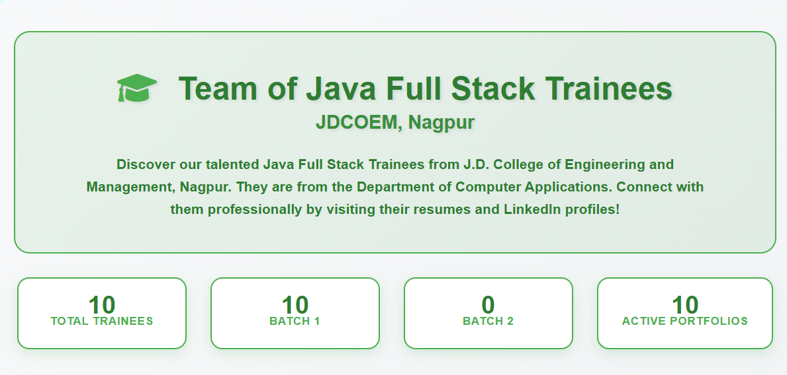
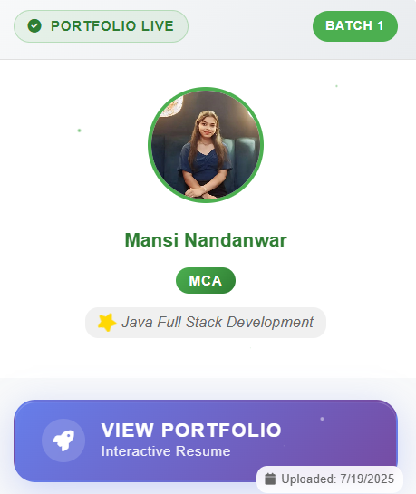
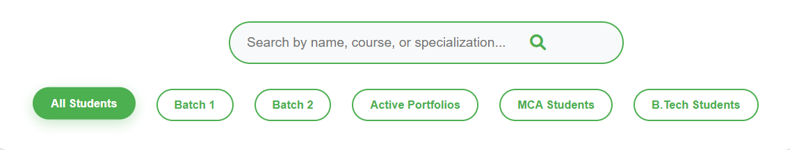
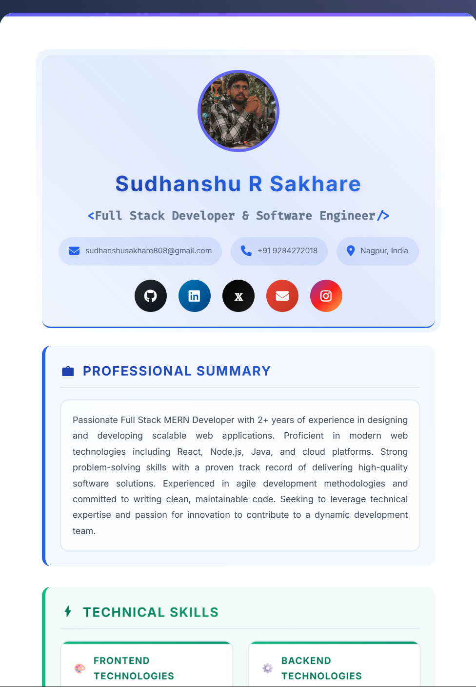

# 🎓 JDCOEM Student Portfolio Management System

A comprehensive web-based portfolio management system for Java Full Stack trainees at J.D. College of Engineering and Management, Nagpur. This system provides an interactive platform to showcase student portfolios with advanced filtering, search capabilities, and modern UI/UX design.


## 📸 Screenshots

### Main Dashboard


_The main dashboard showing all student portfolios with filtering options_

### Student Card Design


_Individual student card with unique "View Portfolio" button and animations_

### Portfolio Button Animation


_Unique portfolio button with gradient effects, particles, and hover animations_

### Filter System


_Advanced filtering system by batch, course, and status_

### Individual Portfolio


_Example of Sudhanshu's interactive portfolio with animations_

## 🚀 Features

### ✨ Core Features

- **Modern Portfolio Cards**: Beautiful card-based design with hover effects
- **Unique Portfolio Button**: Revolutionary gradient button with particle animations
- **Advanced Filtering**: Filter by batch, course, active/pending status
- **Real-time Search**: Search students by name, course, or specialization
- **Responsive Design**: Fully responsive for all device sizes
- **Interactive Animations**: Smooth animations and transitions throughout

### 🎯 Portfolio Button Features

- **Gradient Background**: Purple-to-blue gradient with glow effects
- **Rotating Icon**: Rocket icon that rotates 360° on hover
- **Floating Particles**: Animated particles inside the button
- **Sliding Glow**: Light effect that slides across the button
- **3D Hover Effects**: Lifts and scales on interaction
- **Two-line Text**: "View Portfolio" + "Interactive Resume"

### 📊 Statistics Dashboard

- **Live Counters**: Animated counters showing total students, batches
- **Status Tracking**: Active vs pending portfolio status
- **Real-time Updates**: Stats update based on current filters

## 📁 Project Structure

```
JDCOEM-Portfolio-Manager/
├── 📄 README.md                           # Project documentation
├── 📄 CONTRIBUTING.md                     # Contributing guidelines
├── 📄 LICENSE.md                          # MIT License
├── 🌐 Webpage/
│   ├── 📄 varnan.html                     # Main webpage
│   ├── 🎨 student-portfolio-styles.css    # Portfolio card styles
│   ├── ⚡ student-portfolio-manager.js    # Main JavaScript logic
│   ├── 🎨 index.css                       # Base styles
│   ├── 🎨 index1.css                      # Additional styles
│   └── 🖼️ t.varnan-java-fullstack-trainer.jpg
├── 👨‍💻 Sudhanshu_Sakhare/                  # Example student portfolio
│   ├── 📄 Sudhanshu_Sakhare.html         # Student's portfolio page
│   ├── 🎨 SudhanshuCss.css               # Student's custom styles
│   ├── 🖼️ sudhanshuPic.jpg                # Profile picture
│   └── 📁 js/
│       ├── ⚡ main.js                     # Main portfolio script
│       ├── 🎭 animations.js              # Animation handlers
│       └── 🔄 interactions.js            # User interactions
└── 📁 screenshots/                       # Documentation images
    ├── 🖼️ main-dashboard.png
    ├── 🖼️ student-card.png
    ├── 🎬 portfolio-button.gif
    └── 🖼️ filter-system.png
```

## 🛠️ Installation & Setup

### Prerequisites

- Modern web browser (Chrome, Firefox, Safari, Edge)
- Local web server (optional, for development)
- Basic knowledge of HTML, CSS, JavaScript

### Quick Start

1. **Clone the Repository**

   ```bash
   git clone https://github.com/your-username/jdcoem-portfolio-manager.git
   cd jdcoem-portfolio-manager
   ```

2. **Open the Main Page**

   - Navigate to `Webpage/varnan.html`
   - Open in your web browser
   - Or use a local server:

   ```bash
   # Using Python
   python -m http.server 8000

   # Using Node.js
   npx http-server
   ```

3. **View the Portfolio Manager**
   - Open `http://localhost:8000/Webpage/varnan.html`
   - The system will automatically load and display all students

## 📋 Usage Guide

### For Students

#### Creating Your Portfolio

1. **Create Your Folder**

   ```
   YourName_Surname/
   ├── YourName_Surname.html    # Main portfolio file
   ├── YourNameCss.css          # Your custom styles
   ├── yourPic.jpg              # Profile picture
   └── js/                      # JavaScript files (optional)
       ├── main.js
       ├── animations.js
       └── interactions.js
   ```

2. **Portfolio Requirements**
   - Professional profile picture
   - Complete contact information
   - Skills and technologies
   - Project showcase
   - Professional experience
   - Education details

### For Administrators

#### Adding New Students

```javascript
// Use the browser console to add new students
addNewStudent({
  folderName: "John_Doe_MCA",
  name: "John Doe",
  course: "MCA",
  batch: 1,
  specialization: "Java Full Stack Development",
});
```

#### Updating Student Status

```javascript
// When a student uploads their portfolio folder
updateStudentStatus("Student_Folder_Name", {
  status: "active",
  uploadDate: "2025-01-XX",
});
```

#### Viewing Statistics

```javascript
// Check current repository statistics
getRepositoryStats();
```

## 🎨 Customization Guide

### Modifying the Portfolio Button

The unique portfolio button can be customized in [`student-portfolio-styles.css`](Webpage/student-portfolio-styles.css):

```css
/* Change gradient colors */
.portfolio-btn-unique {
  background: linear-gradient(135deg, #your-color1, #your-color2);
}

/* Modify hover effects */
.portfolio-btn-unique:hover {
  transform: translateY(-5px) scale(1.05);
  box-shadow: 0 20px 40px rgba(your-color, 0.4);
}
```

### Student Data Configuration

Update student information in the [`ResumeInteractions`](Sudhanshu_Sakhare/js/interactions.js) class and portfolio files like [`Sudhanshu_Sakhare.html`](Sudhanshu_Sakhare/Sudhanshu_Sakhare.html).

## 🎯 Key Components

### 1. Portfolio Manager System

- **Student Data Management**: Handles student information and status
- **Filtering & Search**: Real-time filtering and search functionality
- **Card Rendering**: Dynamic generation of student cards
- **Statistics**: Live counter animations and data tracking

### 2. Individual Portfolios

- **Interactive Design**: Modern, animated portfolio pages powered by [`ResumeAnimations`](Sudhanshu_Sakhare/js/animations.js)
- **Social Integration**: Social media links and contact info via [`ResumeInteractions`](Sudhanshu_Sakhare/js/interactions.js)
- **Project Showcase**: Interactive project galleries
- **Professional Layout**: Print-ready resume format with [`SudhanshuCss.css`](Sudhanshu_Sakhare/SudhanshuCss.css)

## 📱 Responsive Design

The system is fully responsive across all devices:

- **Desktop (1200px+)**: Full feature set with advanced hover effects
- **Tablet (768px - 1199px)**: Touch-friendly interactions with optimized layouts
- **Mobile (< 768px)**: Stack layout with simplified navigation

## 🎨 Animation Features

### Card Animations

- **Entrance**: Slide-in with scale effect
- **Hover**: 3D tilt and lift effects
- **Image**: Scale and glow animations
- **Particles**: Floating particle effects

### Portfolio Features

- **Interactive FAB Menu**: Floating action button with multiple options
- **Social Connect Modal**: Animated social media connection popup
- **Theme Toggle**: Dynamic theme switching capability
- **Print Optimization**: Print-ready layouts with optimized styling

## 🔍 Browser Support

| Browser       | Support | Version |
| ------------- | ------- | ------- |
| Chrome        | ✅ Full | 90+     |
| Firefox       | ✅ Full | 88+     |
| Safari        | ✅ Full | 14+     |
| Edge          | ✅ Full | 90+     |
| Mobile Safari | ✅ Full | iOS 14+ |
| Chrome Mobile | ✅ Full | 90+     |

## 🐛 Troubleshooting

### Common Issues

1. **Styles Not Loading**

   ```
   Problem: CSS files not found
   Solution: Check file paths in HTML head section
   ```

2. **JavaScript Errors**

   ```
   Problem: Student data not displaying
   Solution: Check browser console for errors
   ```

3. **Images Not Displaying**

   ```
   Problem: Profile pictures not showing
   Solution: Verify image paths and file names
   ```

4. **Portfolio Links Broken**
   ```
   Problem: "View Portfolio" button not working
   Solution: Check folder structure and file names
   ```

### Debug Mode

Enable debug mode in the console:

```javascript
// Enable debug logging
window.studentPortfolioManager.debug = true;

// Check student data
console.log(window.studentPortfolioManager.studentDirectories);

// Refresh display
refreshPortfolios();
```

## 🤝 Contributing

We welcome contributions from students and faculty! Please read our [Contributing Guidelines](CONTRIBUTING.md) to get started.

### Quick ways to contribute:

- Add your portfolio
- Report bugs
- Suggest improvements
- Enhance documentation

## 📄 License

This project is licensed under the MIT License - see the [LICENSE.md](LICENSE.md) file for details.

## 🎓 Credits

### 👨‍💻 Developers

- **[Sudhanshu R Sakhare](https://www.linkedin.com/in/sudhanshu-sakhare-873598189/)** - Lead Developer, Full Stack MERN Developer
- **[Mansi Nandanwar](http://www.linkedin.com/in/mansi-nandanwar-25037326a)** - Co-Developer, Frontend Specialist

### 🏫 Institution

- **J.D. College of Engineering and Management**, Nagpur, Maharashtra, India
- **Department of Computer Applications**
- **Master of Computer Applications (MCA) Program**

### 👨‍🏫 Mentor

- **T. Varnan (T. Vellaivaranan)** - Java Full Stack Trainer
- **20+ years** of experience in Information Technology
- **Comet Softwares**, Chennai, India

## 📞 Support & Contact

### 🆘 Need Help?

- **Technical Issues**: [Create an issue](https://github.com/your-repo/issues)
- **Feature Requests**: [Submit a request](https://github.com/your-repo/discussions)
- **General Questions**: [Contact us](mailto:sudhanshusakhare808@gmail.com)

### 📧 Contact Information

- **Lead Developer**: [sudhanshusakhare808@gmail.com](mailto:sudhanshusakhare808@gmail.com)
- **Phone**: +91 9284272018
- **Location**: Nagpur, Maharashtra, India

### 🌐 Links

- **Portfolio**: [View Live Portfolio](https://sudhanshu-interactive-resume.netlify.app/)
- **GitHub**: [github.com/Sudhanshu-SRS](https://github.com/Sudhanshu-SRS)
- **LinkedIn**: [linkedin.com/in/sudhanshu-sakhare-873598189](https://www.linkedin.com/in/sudhanshu-sakhare-873598189/)

## 🚀 Future Enhancements

### Planned Features

- [ ] **Admin Dashboard**: Complete admin panel for managing students
- [ ] **Database Integration**: Move from static data to database
- [ ] **User Authentication**: Login system for students and faculty
- [ ] **Portfolio Templates**: Multiple portfolio templates for students
- [ ] **Export Features**: PDF export of portfolios
- [ ] **Analytics**: Portfolio view tracking and analytics

### Technical Improvements

- [ ] **Performance Optimization**: Lazy loading and caching
- [ ] **PWA Support**: Progressive Web App features
- [ ] **Dark Mode**: Complete dark theme implementation
- [ ] **Accessibility**: WCAG 2.1 compliance
- [ ] **Internationalization**: Multi-language support

---

<div align="center">

### 🌟 Star this repository if it helped you! 🌟

[](https://github.com/your-username/jdcoem-portfolio-manager/stargazers)
[](https://github.com/your-username/jdcoem-portfolio-manager/network)

**Made with ❤️ by JDCOEM MCA Students**

_Empowering the next generation of Full Stack Developers_

</div>
